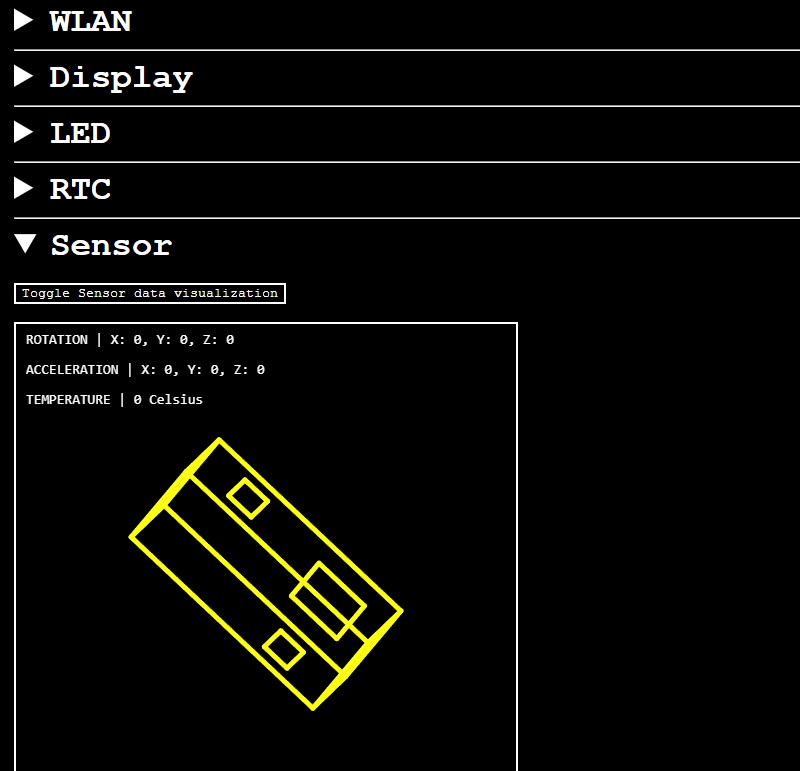

# MicroPython M5StickC Plus2 Admin

An admin web page for M5StickC Plus2 with MicroPython.

Use this as a base for your projects.



## Usage

1. Flash your device with MicroPython. See more about [below](#flashing-your-device).
2. Create local Python environment:

```bash
pip3 -m venv .venv
source .venv/bin/activate
pip3 install -r requirements.txt
```

3. Use VS Code tasks or copy the files directly:

```bash
rshell --port /dev/ttyACM0 --baud 115200 cp -r cplus2_admin/* /pyboard
```

4. Boot your device if VS Code task was not used:

```bash
rshell --port /dev/ttyACM0 --baud 115200 repl '~ import machine ~ machine.reset()'
```

## VS Code tasks

- `clear`: delete all files on the flash
- `copy`: copy all the files to the flash
- `list`: list files on flash (non recursive)
- `repl`: connect to MicroPython REPL
- `run`: run `copy` task and restart device
- `shell`: starts `rshell` shell

Change port and baud rate if needed:

```json
"env": {
    "PORT": "/dev/ttyACM0",
    "BAUDRATE": "115200"
}
```

## Flashing your device

1. Clone idf repository and make it shell-accessible:

    ```bash
    $ git clone -b v5.0.4 --recursive https://github.com/espressif/esp-idf.git
    $ cd esp-idf
    $ git checkout v5.0.4
    $ git submodule update --init --recursive
    $ ./install.sh       # (or install.bat on Windows)
    $ source export.sh   # (or export.bat on Windows)
    ```

    You will need to run `source export.sh` for every new session.

2. Clone MicroPython repository and checkout to the supported version:

    ```bash
    $ git clone https://github.com/micropython/micropython
    $ cd ./micropython
    $ git checkout v1.23.0
    ```

3. Compile cross compiler:

    ```bash
    $ make -C mpy-cross
    ```

4. Enter esp32 port folder:

    ```bash
    $ cd ./ports/esp32
    ```

5. MicroPython builds for 4MB flashes by default. To use all the 8MB from ESP32-PICO-V3-02 flash, change the lines `95-97` of file `boards/sdkconfig.base` from

    ```bash
    CONFIG_ESPTOOLPY_FLASHSIZE_4MB=y
    CONFIG_PARTITION_TABLE_CUSTOM=y
    CONFIG_PARTITION_TABLE_CUSTOM_FILENAME="partitions-4MiB.csv"
    ```

    to

    ```bash
    CONFIG_ESPTOOLPY_FLASHSIZE_8MB=y
    CONFIG_PARTITION_TABLE_CUSTOM=y
    CONFIG_PARTITION_TABLE_CUSTOM_FILENAME="partitions-8MiB.csv"
    ```

6. Compile for board `ESP32_GENERIC-SPIRAM`:

    ```bash
    $ make submodules
    $ make BOARD=ESP32_GENERIC BOARD_VARIANT=SPIRAM
    ```

    **Note**: MicroPython with SPIRAM variant uses the PSRAM as available RAM. This increases the RAM to 2MB, however it is slower than the 520KB SRAM. If you need more speed, remove `BOARD_VARIANT=SPIRAM` from all commands, but some functions will not work due the buffer size needed.

7. Flash device (change port if needed):

    ```bash
    $ make PORT=/dev/ttyACM0 erase 
    $ make BOARD=ESP32_GENERIC BOARD_VARIANT=SPIRAM PORT=/dev/ttyACM0 deploy
    ```

## Credits

The following modules are derived from third-party sources:

- `colors`: from https://github.com/gandro/micropython-m5stickc-plus
- `logging`: from https://github.com/micropython/micropython-lib
- `mpu6886`: from https://github.com/tuupola/micropython-mpu6886
- `pcf8563`: from https://github.com/gandro/micropython-m5stickc-plus
- `st7789`: from https://github.com/gandro/micropython-m5stickc-plus
- `time`: from https://github.com/micropython/micropython-lib
- `tinyweb`: from https://github.com/belyalov/tinyweb